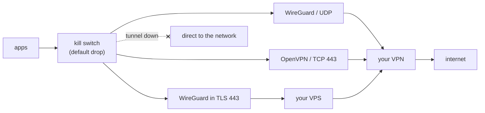

# toriid

[English](README.md) · [日本語](README.ja.md)

信頼できないネットワークで使う Linux ノート PC のための、VPN キルスイッチとトンネル管理。
名前は鳥居（torii）+ デーモンの d から。

トンネルが落ちたら何も外に出さない。WireGuard が塞がれていれば TCP 443 の OpenVPN、さらに TLS に
包んだ WireGuard（[wstunnel](https://github.com/erebe/wstunnel)）に切り替える。キャプティブポータルは
隔離した namespace で処理し、その間もキルスイッチは切らない。

```
$ torii
mode      auto | WireGuard/UDP
phase     up | exit 198.51.100.20 | handshake 12s ago
network   Cafe-Guest (hostile) | wlan0 | connectivity full
protect   killswitch loaded | LAN blocked
```

## 機能

- nftables のキルスイッチ。起動時に読み込み、穴は VPN サーバー宛てだけ
- フォールバック：WireGuard → OpenVPN/TCP → TLS 内の WireGuard。ネットワークごとに通ったものを記憶
- クリックだけのポータルは自動で通過、ログインが要るものは隔離ブラウザで開く
- ウォッチドッグ：スリープ復帰・ネットワーク変更・切断のあとに再接続
- トンネル内でも Tailscale はそのまま使える
- iwd / NetworkManager 対応
- waybar、polybar、i3blocks、eww/ags、Quickshell 向けのステータス出力

WireGuard ならどのプロバイダでも自前サーバーでも使える。TLS の段には VPS が必要で、
[`server/`](server) のスクリプトで用意できる。



仕組みの詳細（英語）：[`docs/architecture.md`](docs/architecture.md)。

## 実際の使われ方

普段使っているネットワークでの動き：

| ネットワーク | 動き |
|---|---|
| 自宅（`trusted` に登録） | WireGuard。LAN の機器（プリンタ、NAS、ssh）に届く |
| カフェ | WireGuard。LAN は遮断 |
| UDP を塞ぐゲスト Wi-Fi | WireGuard がタイムアウトし、TCP 443 の OpenVPN に切り替え |
| OpenVPN も DPI で落とすネットワーク | TLS 内の WireGuard まで下がる。次回はそこから始める |
| 「同意」ボタンだけのホテル | ポータルを自動で通過し、WireGuard に戻る |
| 部屋番号やパスワードが要るポータル | 通知が出る。`torii portal` で隔離ブラウザに開く |
| スリープ復帰で別のネットワークに | ウォッチドッグが気づき、前回そこで通ったモードを選ぶ |

どの場合も、切り替え中を含めてトンネル外には何も出ない。状況はバーに出るので、操作が要るのは求められたときだけ。

## インストール

```sh
cargo build --release
sudo install -m755 target/release/toriid /usr/bin/toriid
sudo ln -s toriid /usr/bin/torii
sudo install -Dm644 dist/config.toml /etc/toriid/config.toml
sudo install -m644 dist/systemd/*.service /etc/systemd/system/
sudo install -Dm644 dist/tmpfiles/toriid.conf /etc/tmpfiles.d/toriid.conf
sudo systemd-tmpfiles --create toriid.conf
sudo systemctl enable --now toriid-killswitch-boot toriid
sudo install -Dm644 -t /etc/systemd/user dist/systemd/user/*
systemctl --user enable --now toriid-notify          # デスクトップ通知
```

libnftables が必要（Debian/Ubuntu でビルドするなら `libnftables-dev`）。x86_64 のビルド済みバイナリは
[releases](https://github.com/awaiiro/toriid/releases) にある。Arch：[`dist/arch/PKGBUILD`](dist/arch/PKGBUILD)。
`torii portal` は Firefox を使う。

あとは WireGuard の設定を `/etc/wireguard/wg0.conf` に置き、`/etc/toriid/config.toml` の `operator`
を自分のユーザー名にして `torii up`。設定項目は [`dist/config.toml`](dist/config.toml)。

`sudo torii down` で保護をすべて外す。

## 使い方

```
torii                    status
torii up [MODE]          auto | wireguard | openvpn | wstunnel
torii down               remove protection (sudo)
torii portal             open the captive portal page
torii log [-f]           logs
torii wifi list|connect
torii watch              status as JSON, one line per change
torii bar waybar         status for a bar (also polybar, i3blocks, plain, json)
```

バーの設定例：[`examples/`](examples)。JSON 形式：[`docs/status-json.md`](docs/status-json.md)。

## セキュリティ

守る相手は今つないでいるネットワークで、VPN プロバイダではない。詳細と非 root ユーザーにできること：
[`docs/security.md`](docs/security.md)。

テスト：`cargo test`、`test/leak-test.sh`（実パケットでキルスイッチを確認、root 不要）、
`test/vm-e2e.sh`（使い捨て VM で全体を実行）。

## ライセンス

MIT
