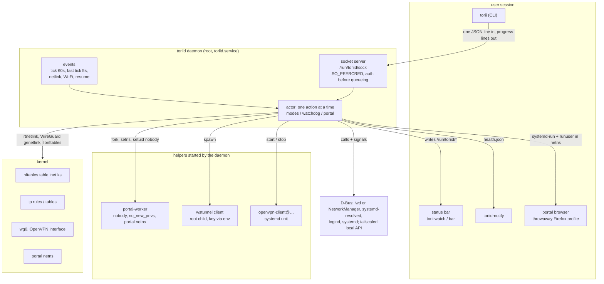
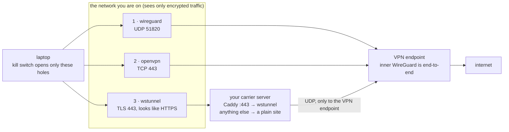
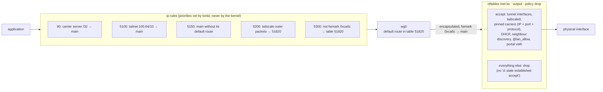
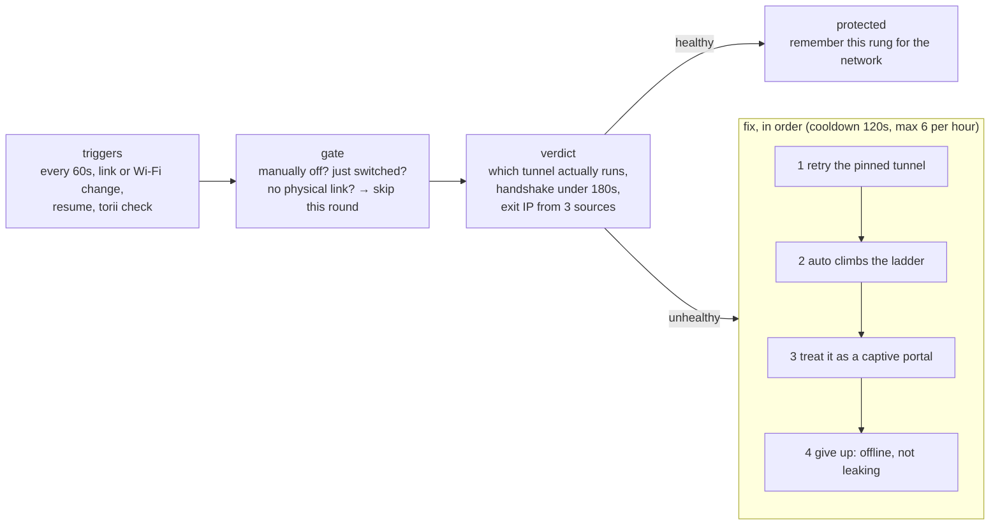
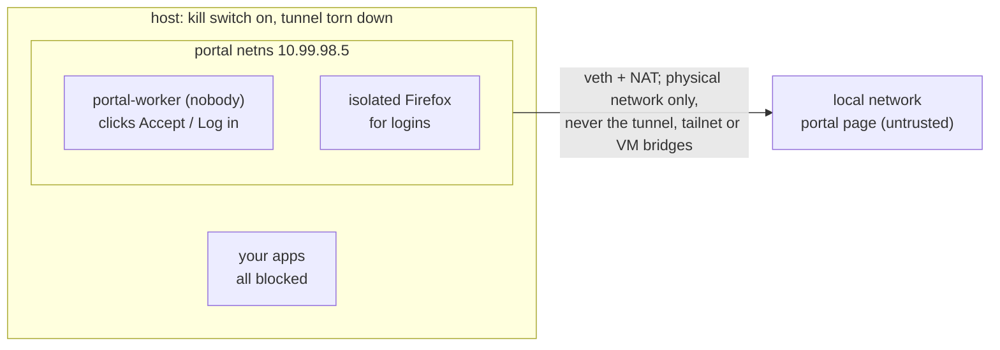

# How toriid works

Only one process may change the network: the root daemon `toriid daemon`. Everything else either asks
it over a socket or reads the state files it writes. All numbers below (rule priorities, intervals,
addresses, limits) come from the source.

- [Processes and channels](#processes-and-channels)
- [The tunnel ladder](#the-tunnel-ladder)
- [A packet's path through the laptop](#a-packets-path-through-the-laptop)
- [Watchdog](#watchdog)
- [Captive portals](#captive-portals)
- [Who may do what](#who-may-do-what)
- [Files](#files)

## Processes and channels

Untrusted input (captive portal HTML) is parsed by `portal-worker`, which enters the portal namespace and
drops to `nobody` before reading anything.

## The tunnel ladder

`auto` starts at the rung that last worked on this network (`/var/lib/toriid/mode-profile`) and falls
through the rest of `[tunnels] ladder`. A rung counts as up only after a real exit IP is measured
through it. `[networks.pin]` fixes a network to one mode.

The wstunnel rung has three TLS variants, tried most secure first:

| Variant | SNI | Certificate verified |
|---|---|---|
| `clean` | none | yes |
| `named` | real name | yes |
| `disguised` | fake name | no (last resort; the inner WireGuard stays encrypted) |

## A packet's path through the laptop

When the tunnel goes down, rule 5300 has nowhere to send packets and they fall back to the main table,
but the output chain only accepts tunnel interfaces and the pinned holes, so they are dropped instead of
leaving in cleartext. Established connections die with the tunnel; `test/leak-test.sh` checks this with
real packets.

The ruleset is rendered from config on every mode change and replaced atomically. The last one that
loaded is kept in `/var/lib/toriid/killswitch.nft`, which `toriid-killswitch-boot.service` loads at boot
before any network comes up.

## Watchdog

The exit IP is cached for 10 minutes on AC and 15 on battery while everything stays healthy. Every
5 seconds the daemon also writes a heartbeat to `health.json`, measures connectivity (inside the portal
namespace when the host cannot reach anything), puts back the DNS routing domain if tailscaled grabbed
`~.`, and brings protection up on a trusted network that has none.

## Captive portals

Passed automatically: a form with an Accept / Log in / Connect button and nothing to fill in (only that
button is submitted), a page with a single login link, Meraki grant links. Handed to you: password
fields, required inputs (room number, email), several candidate links. Once the portal lets you
through, protection comes back on its own.

## Who may do what

Adding protection needs no sudo; removing it does.

| Caller | Allowed |
|---|---|
| any local user | `torii status`, `torii watch`, reading the state files |
| operator (`[daemon] operator`) | `up` in any tunnel mode, `check`, wstunnel log and key rotation; portal mode while the network is broken |
| root | everything, including `down` |

Status states for bars: `protected`, `connecting`, `blocked` (no network, no leak), `leaking` (kill
switch not loaded), `portal`, `off`, `unknown` (daemon not reporting for 150 s).
See [status-json.md](status-json.md) and [security.md](security.md).

## Files

| Path | What | Written / read by |
|---|---|---|
| `/etc/toriid/config.toml` | main config | you / daemon (must be root-owned) |
| `/etc/toriid/wstunnel.conf` | carrier servers, keys, variants (0600) | daemon (key rotation writes through it) |
| `/etc/wireguard/wg0.conf` | your VPN's WireGuard config (PostUp not executed) | daemon |
| `/run/toriid/health.json` | heartbeat, verdict, advice; every 5 s | daemon / bars, notifier, `torii` |
| `/run/toriid/mode`, `step`, `class` | intent, current step, network class | daemon / bars |
| `/run/toriid/sock` | control socket | `torii` ↔ daemon |
| `/var/lib/toriid/killswitch.nft` | last loaded ruleset, replayed at boot | daemon / boot unit |
| `/var/lib/toriid/mode-profile` and friends | per-network rung, wstunnel variant, how portals were passed | daemon |
